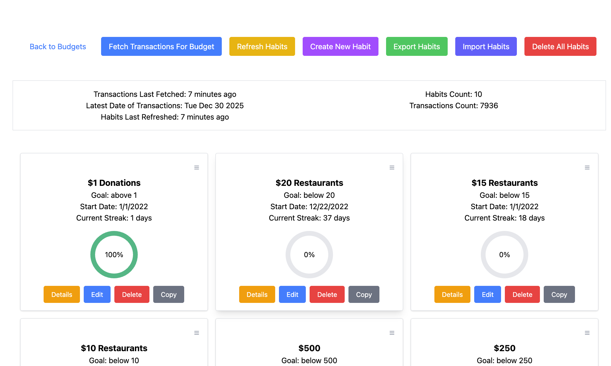
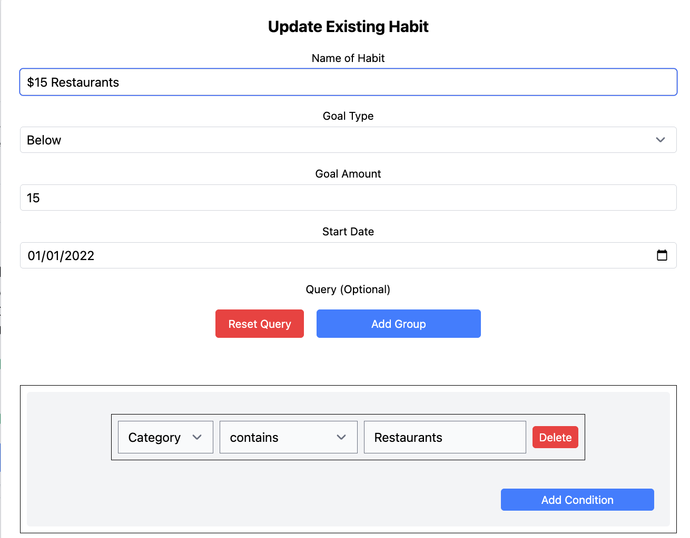

# Streaks For YNAB

A web app for tracking spending habits with YNAB.

Built on [SvelteKit](https://svelte.dev/docs/kit/introduction).

For any bug reports or feature requests, visit the [issues](https://github.com/danielh-official/streaksforynab/issues) page.

## Local Development

1. Fork and clone

```bash
git clone https://github.com/YOUR-USERNAME/streaksforynab.git
cd streaksforynab
```

2. Install packages: `pnpm install`
3. Run the server: `pnpm dev`

## What is this?

Streaks For YNAB allows you to track your spending in the form of habits. Basically, you can write something like "Under $15 Restaurants" and it will use your YNAB transactions to track how often you spend over $15 on Restaurants.

Your goal is to continue the streak as much as possible and avoid being in the red.

See a list of all your habits, with indicators for how close you are to breaking them today:



Finely tune what kinds of transactions you want to include in your habit with filtering:



View a calendar and other stats for any habit:


---

## Important Details To Consider

For information on how your YNAB data is received and stored, view the [privacy policy](./PRIVACY.md).

> [!IMPORTANT]
> At this time, there is no automatic sync engine to backup your habit data to a server database on any of my deployments of this code.

Your data is stored 100% locally on your browser for the given domain (.e.g, [https://danielh-official.github.io/streaksforynab](https://danielh-official.github.io/streaksforynab)).

YNAB transactions are property of YNAB and can always be retrieved again via the API, but habits are stored locally on your browser for the specific domain you're using.

You may export your habits if you intend to:
- Use a different browser/computer
- Use this codebase on a different domain

And then import them into the new location.

Exporting ignores transactions and any other data that belong to YNAB to ensure the process is fast, so fresh imports will require a fresh fetch from YNAB via "Fetch Transactions For Budget".

As this instance of Streaks For YNAB is open-source, you may fork this repository at any time, add any features or improvements, and deploy your own version to your own domain (e.g., `mypersonaldeploymentofstreaksforynab.netlify.app`).